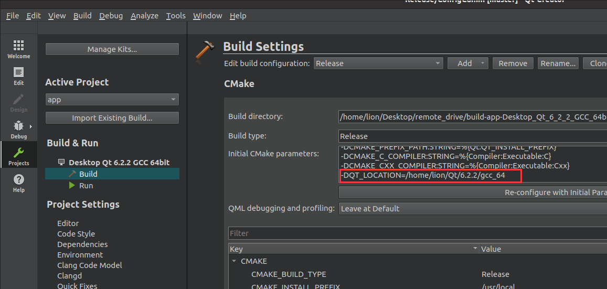
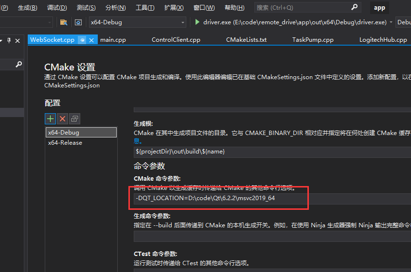

# 目录说明  
base:客户端基础库  
car:车端主程序    
common:客户端公用代码  
driver:驾驶端  
linux_install:linux打包程序  
test:测试程序  
windows_install:windows打包程序  
car_bridge:车端桥接程序  
# 编译 
安装Qt6最新的LTS版本,车端建议ubuntu20.04及以上版本,默认你已经掌握QtCreator和Visual Studio中编译CMake工程。
1. 64位车端主程序编译
- Linux下安装ffmpeg依赖库
    >sudo apt install libx265-dev libx264-dev liblzma-dev
- Linux下安装opengl依赖库
    >sudo apt-get install build-essential libgl1-mesa-dev
- QtCreator中配置QT_LOCATION,如图:  
  
点击按钮"Re-configure with initail Parameters"
2. 车端桥接程序编译    
- 安装go(版本>= 1.18)  
- 进入car_bridge目录,运行命令:go build,即可完成编译  
3. 64位驾驶端编译(只支持windows)  
- Visual Studio(建议2019)中配置QT_LOCATION,如图:  
  

注:驾驶端在QtCreator中的编译参照车端主程序  

# 打包  
1. 车端主程序打包
    >cd app/car  
    >\#文件VERSION中设置新的版本号  
    >\#重新编译car程序   
    >cd app/linux_install  
    >\#执行打包脚本  
    >build_car_installer.sh  
1. 驾驶端打包  
    >cd app/driver/res  
    >\#在文件version.h中设置版本号,宏定义`VERSION_MAJOR`、`VERSION_MINOR`、`VERSION_BUILD`、`VERSION_REVISION`,最终会影响驾驶端主程序`driver.exe`右键属性中,`详细信息`栏里的的`产品版本`  
    >\#完全重新编译驾驶端  
    >cd app/windows_install  
    >\#version.h头文件修改宏AppVersion,设置包版本号  
    >\#运行打包脚本(如果提示driver.exe被占用,重新运行打包脚本)  
    >setup.bat  
1. 车端桥接打包  
    车端桥接程序编译之后,只生成一个单独的执行程序文件car_bridge,不需要打包  

# 部署  
1. 车端主程序部署  
    1.1 生成车端主程序docker镜像文件car_docker_image.tar(需要提前编译release版本)    
    >cd app/linux_install  
    >\#运行`创建镜像文件`脚本    
    >sudo ./build_car_dockerimage.sh 

    1.2 在叉车上导入docker镜像文件并运行容器  
    >cd [car_docker_image.tar所在目录]  
    >\#导入镜像  
    >sudo docker load -i car_docker_image.tar  
    >\#通过如下命令运行该镜像(需要停止之前的车端主程序容器)    
    >sudo docker run -p 6667:6667 --privileged=true --restart=always -it remote_drive

    1.3 进入容器中车端主程序所在目录,设置配置文件ConfigCar.ini  
    >\#进入容器  
    >sudo docker exec -it [容器名] /bin/bash  
    >\#使vim支持中文  
    >vim /etc/vim/vimrc      
    >\#/etc/vim/vimrc文件中输入一下文本:    
    >&emsp;&emsp;&emsp;&emsp;set fileencodings=utf-8,gb2312,gbk,gb18030  
    >&emsp;&emsp;&emsp;&emsp;set termencoding=utf-80  
    >&emsp;&emsp;&emsp;&emsp;set encoding=prc   
    >\#进入车端主程序目录  
    >cd /home/remote_drive_car 
    >\#在ConfigCar.ini中配置车名和摄像头usb序号(参照ConfigCar.ini中注释),字段:`Account/info`,`Camera/[left|right|front|back]`  
    >vim ConfigCar.ini  
    >\#重启容器  
    >sudo docker restart [容器名]

    注:
    1. 利用docker解决低版本ubuntu无法运行Qt6,在宿主系统设置自启动车端桥接程序(go_server/car_bridge)，通过car_bridge，完成车端主程序和ros系统的间接交互  
    1. 以上针对的是没有安装车端主程序的车辆,如果车辆已经安装了车端主程序,则在后勤服务中更新[车端更新源](../go_server/README.md)  
1. 车端桥接程序部署  
    >\#将car_bridge程序复制到车端系统  
    >\#给car_bridge赋予执行权限  
    >chmod 777 car_bridge    
    >\#文件"/etc/rc.local"中，在"exit 0"命令的上一行，输入命令"nohup [car_bridge全路径] >[日志全路径] 2>&1 &",以设置car_bridge程序自启动   
    >vim ConfigCar.ini

    注:理论上，car_bridge只要能和ros进行通信，能和car连接，部署到任何位置都可以，包括部署到其他机器  
1. 驾驶端程序部署  
    >\#对于已经安装了驾驶端的系统,只需要更新[驾驶端更新源](../go_server/README.md)  
    >\#对于没有安装驾驶端的系统,直接运行驾驶端安装包完成安装  
    注：需要提前安装[罗技方向盘驱动](https://download01.logi.com/web/ftp/pub/techsupport/gaming/lghub_installer.exe)